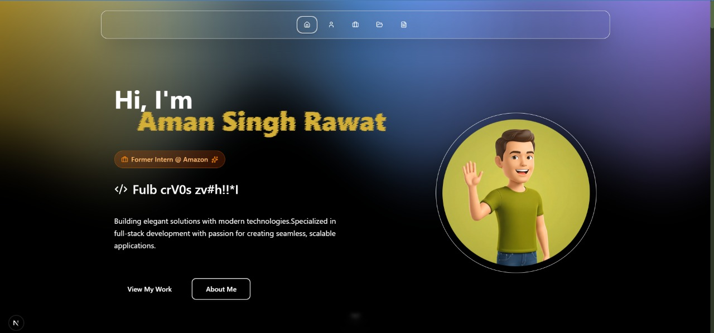

# 🚀 Aman Singh Rawat - Portfolio

<div align="center">
  
  
  <p align="center">
    <strong>A modern, interactive portfolio showcasing software development expertise</strong>
  </p>
  
  [](https://nextjs.org/)
  [](https://reactjs.org/)
  [](https://www.typescriptlang.org/)
  [](https://tailwindcss.com/)
  [](https://www.framer.com/motion/)
</div>

---

## 📋 Table of Contents

- [🎯 Overview](#-overview)
- [✨ Features](#-features)
- [🛠️ Tech Stack](#️-tech-stack)
- [🏗️ Project Structure](#️-project-structure)
- [🚀 Getting Started](#-getting-started)
- [📱 Sections](#-sections)
- [🎨 Custom Effects](#-custom-effects)
- [📊 Performance](#-performance)
- [🔧 Configuration](#-configuration)
- [📦 Dependencies](#-dependencies)
- [🤝 Contributing](#-contributing)
- [📄 License](#-license)
- [📞 Contact](#-contact)

---

## 🎯 Overview

This is a cutting-edge, interactive portfolio website built with modern web technologies. The portfolio showcases Aman Singh Rawat's software development journey, featuring dynamic animations, smooth transitions, and an immersive user experience that reflects professional expertise in full-stack development.

### Key Highlights

- **Interactive Avatar System**: Dynamic avatar states that change based on user interaction
- **Smooth Scroll Experience**: Custom scroll animations with Lenis integration
- **Advanced Visual Effects**: Custom CSS effects including metallic borders, aurora backgrounds, and gradual blur
- **Responsive Design**: Optimized for all device sizes with mobile-first approach
- **Performance Optimized**: Built with Next.js 15 for optimal loading and SEO

---

## ✨ Features

### 🎭 Interactive Elements

- **Dynamic Avatar States**: Avatar responds to scroll position and section changes
- **Smooth Transitions**: Framer Motion powered animations throughout
- **Scroll-Based Effects**: Elements animate based on viewport position
- **Interactive Project Cards**: Hover effects and detailed project showcases

### 🎨 Visual Design

- **Modern UI/UX**: Clean, professional design with attention to detail
- **Custom Animations**: Unique CSS effects and transitions
- **Responsive Layout**: Seamless experience across all devices
- **Dark Theme**: Elegant dark color scheme with accent colors

### 📱 Sections

- **Home**: Hero section with animated text and avatar
- **About**: Personal story and skills showcase
- **Experience**: Professional journey with Amazon and GeoSolutions
- **Projects**: Interactive showcase of 5 major projects
- **Resume**: Downloadable resume with PDF viewer

---

## 🛠️ Tech Stack

### Frontend

- **Next.js 15.5.3** - React framework with App Router
- **React 19.1.0** - Latest React with concurrent features
- **TypeScript 5.0** - Type-safe development
- **Tailwind CSS 4.0** - Utility-first CSS framework

### Animation & Effects

- **Framer Motion 12.23.18** - Advanced animations and gestures
- **React Spring 10.0.3** - Physics-based animations
- **Lenis 1.3.11** - Smooth scrolling library
- **Custom CSS Effects** - Metallic borders, aurora backgrounds, gradual blur

### Development Tools

- **ESLint** - Code linting and formatting
- **PostCSS** - CSS processing
- **TypeScript** - Static type checking

---

## 🏗️ Project Structure

```
my_portfolio/
├── public/                     # Static assets
│   ├── images/                # Project screenshots
│   ├── videos/                # Section demonstration videos
│   ├── resume.pdf             # Downloadable resume
│   └── home.png               # Portfolio screenshot
├── src/
│   ├── app/                   # Next.js App Router
│   │   ├── globals.css        # Global styles
│   │   ├── layout.tsx         # Root layout
│   │   └── page.tsx           # Home page
│   ├── components/            # React components
│   │   ├── common/           # Reusable components
│   │   ├── effects/          # Custom visual effects
│   │   ├── layout/           # Layout components
│   │   ├── sections/         # Page sections
│   │   └── ui/               # UI components
│   ├── hooks/                 # Custom React hooks
│   ├── lib/                   # Utility libraries
│   ├── styles/                # Custom CSS files
│   ├── types/                 # TypeScript type definitions
│   └── utils/                 # Helper functions
├── components.json            # Component configuration
├── next.config.ts            # Next.js configuration
├── tailwind.config.ts        # Tailwind CSS configuration
└── tsconfig.json             # TypeScript configuration
```

---

## 🚀 Getting Started

### Prerequisites

- Node.js 18.0 or later
- npm or yarn package manager

### Installation

1. **Clone the repository**

   ```bash
   git clone https://github.com/rawattji/My_PortFolio.git
   cd My_PortFolio
   ```

2. **Install dependencies**

   ```bash
   npm install
   # or
   yarn install
   ```

3. **Run the development server**

   ```bash
   npm run dev
   # or
   yarn dev
   ```

4. **Open your browser**
   Navigate to [http://localhost:3000](http://localhost:3000) to view the portfolio.

### Build for Production

```bash
npm run build
npm start
```

---

## 📱 Sections

### 🏠 Home Section

- **Animated Hero Text**: Dynamic typing animation with React Type Animation
- **Interactive Avatar**: Avatar state changes based on scroll position
- **Smooth Scroll Indicators**: Visual cues for navigation

### 👨‍💻 About Section

- **Personal Story**: Professional journey and background
- **Skills Showcase**: Technical skills with visual indicators
- **Achievement Highlights**: Key accomplishments and metrics

### 💼 Experience Section

- **Amazon SDE Intern**: Jan 2025 - Jun 2025
  - Reduced verification overhead by 65%, saving $80/sec
  - Enhanced workflow consistency by 30%
  - Improved system resilience by 45%
- **GeoSolutions India SDE Intern**: Sep 2024 - Dec 2024
  - Delivered 25% revenue growth through advanced visualizations
  - Improved analytics accuracy by 40%
  - Reduced deployment time by 30%

### 🚀 Projects Section

Interactive showcase of 5 major projects:

1. **Activity Tracker** - Chrome Extension

   - React.js, Ruby on Rails, MongoDB
   - Productivity monitoring and distraction blocking

2. **Work Orbit** - Task Management Platform

   - React.js, TypeScript, Node.js, PostgreSQL
   - Multi-tenant architecture with role-based permissions

3. **Sure Reads** - Book Discovery App

   - React.js, Redux, External API
   - Smart caching and infinite scroll pagination

4. **Rush Fashion** - E-Commerce Website

   - WordPress, HTML, CSS, JavaScript, PHP
   - Full-featured online store with custom functionality

5. **Scroll Day&Night** - Animation Showcase
   - HTML, CSS, JavaScript, Elementor
   - Advanced CSS animations and scroll-based interactions

### 📄 Resume Section

- **PDF Viewer**: In-browser resume viewing
- **Download Option**: Direct resume download
- **Professional Formatting**: Clean, ATS-friendly layout

---

## 🎨 Custom Effects

### Metallic Paint Effect

Custom CSS effect creating metallic borders and gradients with dynamic animations.

### Aurora Background

Animated gradient backgrounds that create an aurora-like effect with smooth color transitions.

### Gradual Blur

Scroll-based blur effects that create depth and focus on specific sections.

### Scroll Stack

Layered scroll animations that create a parallax-like effect with multiple elements.

### Spotlight Card

Interactive cards with spotlight effects that follow mouse movement.

---

## 📊 Performance

- **Next.js 15**: Latest framework with optimized performance
- **Image Optimization**: Automatic image optimization and lazy loading
- **Code Splitting**: Automatic code splitting for faster loading
- **SEO Optimized**: Built-in SEO features with meta tags
- **Mobile Optimized**: Responsive design with touch-friendly interactions

---

## 🔧 Configuration

### Environment Variables

Create a `.env.local` file for any environment-specific configurations:

```env
# Add your environment variables here
NEXT_PUBLIC_PORTFOLIO_URL=https://rawattji.github.io/My_PortFolio
```

### Customization

- **Colors**: Modify `tailwind.config.ts` for custom color schemes
- **Animations**: Adjust animation parameters in `src/utils/animations.ts`
- **Content**: Update personal information in `src/utils/constants.ts`

---

## 📦 Dependencies

### Core Dependencies

- `next@15.5.3` - React framework
- `react@19.1.0` - UI library
- `typescript@5.0` - Type safety
- `tailwindcss@4.0` - CSS framework

### Animation Libraries

- `framer-motion@12.23.18` - Animation library
- `@react-spring/web@10.0.3` - Physics animations
- `lenis@1.3.11` - Smooth scrolling
- `react-type-animation@3.2.0` - Typing animations

### UI Components

- `lucide-react@0.544.0` - Icon library
- `react-icons@5.5.0` - Additional icons
- `bits-ui@2.11.0` - Headless UI components

### Utilities

- `clsx@2.1.1` - Conditional classes
- `tailwind-merge@3.3.1` - Tailwind class merging
- `class-variance-authority@0.7.1` - Component variants

---

## 🤝 Contributing

Contributions are welcome! Please feel free to submit a Pull Request. For major changes, please open an issue first to discuss what you would like to change.

### Development Guidelines

1. Follow TypeScript best practices
2. Use meaningful commit messages
3. Ensure responsive design
4. Test across different browsers
5. Maintain performance standards

---

## 📄 License

This project is licensed under the MIT License - see the [LICENSE](LICENSE) file for details.

---

## 📞 Contact

**Aman Singh Rawat**

- 📧 Email: [amanrawatmait@gmail.com](mailto:amanrawatmait@gmail.com)
- 💼 LinkedIn: [linkedin.com/in/amanrawatmait](https://linkedin.com/in/amanrawatmait)
- 🐙 GitHub: [github.com/rawattji](https://github.com/rawattji)
- 🌐 Portfolio: [rawattji.github.io/My_PortFolio](https://rawattji.github.io/My_PortFolio)
- 📱 Phone: +91 828795941

---

<div align="center">
  <p>Made with ❤️ by Aman Singh Rawat</p>
  <p>© 2024 All rights reserved</p>
</div>
